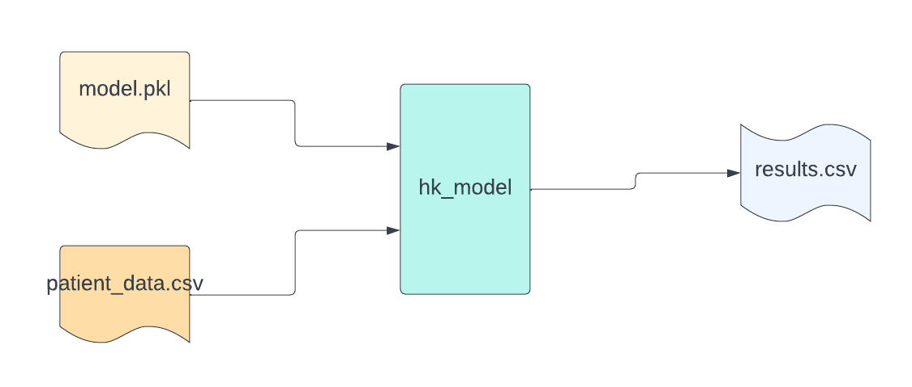

# hk_model: Streamlined Machine Learning Deployment

The `hk_model` project offers a pipeline for efficiently deploying and running trained machine learning models. Designed to streamline the process from model training to deployment, this tool is a vital asset for data scientists and ML engineers.

<p align="center">
  
  
  
  
</p>



Click on the image below to watch the demo video:

[](https://www.youtube.com/watch?v=Ycl_yTK0Dig)


## 1. Description
**Amphora Health's hk_model**: A Biomedical ML Pipeline. Our `hk_model` effortlessly evaluates trained biomedical machine learning models against new patient datasets. Discover a curated collection of pre-trained models in our `models` folder, ready for diverse medical data analysis applications.

## 2. Installation

### Folder Structure
Organized and intuitive, the `hk_model` project structure is as follows:


    .
    ├── docs/
    ├── data/
    ├── engineering/
	├── env/
	├── models/
    ├── main.sh
    ├── requirements.txt
    └── README.md
    
    
This structure ensures a seamless navigation and operation of the pipeline.

### Prerequisites
To set up `hk_model`, ensure all prerequisites are met. Refer to our `requirements.txt` for a comprehensive list of necessary dependencies. This file provides all you need to prepare your environment for using `hk_model`.


## 3. Usage
To run this **hk_model** Pipeline, you will need to be in the top level folder and then execute the following command to be run in Unix (Mac):

```bash
make run_model FILE=fileNameIn MODEL=modelName
```

#### Parameters Explained
Understand each parameter for a successful execution:

| Parameter | Argument         | Description |
|-----------|------------------|-------------|
| `FILE`    | `<input_file_name>` | Name of the input file located in `data/raw/`. This file should contain new instances for prediction. |
| `MODEL`   | `<model_name>`   | Name of the pre-trained model for predictions, found in `src/models/`. |

### Examples

To run the pipeline with one sample file:
```bash
make run_model FILE=hk_sample.csv MODEL=gaussian_e112.pkl
```

## 4. Citation
For academic referencing, please cite our work as follows:

> Tripp et al. (2023). "DiabetIA: Building Machine Learning Models for Type 2 Diabetes Complications." MedRXiv. [DOI](https://doi.org/10.1101/2023.10.22.23297277).


## 5. Development Status

### Developers
The `hk_model` repository is a product of Amphora Health's team:

- Joaquin Tripp - *Data Science Manager*  
  📧 joaquintripp [at] amphora.health

- Daniel Santana - *Data Scientist*  
  📧 daniel [at] amphora.health


### Current Release
- **Version 1.0**  
  Released on Jan 17, 2024  
  Status: 🟢 Stable Release


 

## 6. License
Please refer to our MIT license in this repository.

